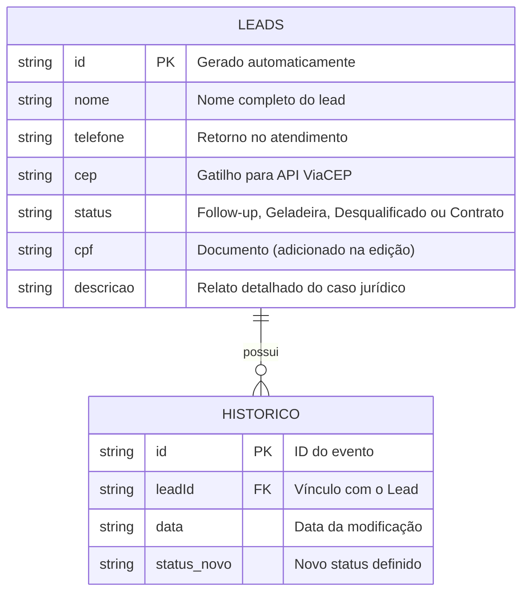

# 🛠️ Especificação Técnica (Tech Spec) - LexFlow
Este documento detalha a arquitetura técnica, o modelo de dados e as integrações de API necessárias para o funcionamento do sistema de triagem jurídica LexFlow.

## 1. Modelo de Dados (Diagrama ER)

Abaixo está a representação da estrutura do nosso banco de dados simulado (db.json) e como as entidades se conectam para permitir o histórico de atendimento.

## 2. Dicionário de Dados

Breve explicação das tabelas principais:

- **Tabelas: leads** Responsável por armazenar os dados de autenticação e o saldo consolidado do usuário.
  - Id: Identificador único gerado pelo JSON Server (String ou Hash).
  - Nome: Nome do lead (obrigatório)
  - Status: Define a fase no funil jurídico. Valores aceitos: Follow-up, Geladeira, Desqualificado, Contrato.
  - Cep/Endereço:Dados de localização. O campo endereco é composto pelos dados retornados pela API externa.
  - CPF: Campo opcional na entrada, obrigatório para fechamento de contrato.
  - Descrição: Campo de texto longo para o resumo do caso.

- **Tabela: Historico** 
Registra a linha do tempo de interações com o lead.
  - LeadId: Chave estrangeira que conecta o histórico ao cliente específico.
  - Alteração:Texto descrevendo o que mudou (Ex: "Cliente movido para Geladeira por falta de documentos"). 

## 3. Rotas da API (JSON Server)

O LexFlow utiliza dois tipos de serviços de dados para funcionar:

🌐 API Pública: ViaCEP
Utilizada para automatizar o preenchimento de endereços e reduzir erros de digitação durante a triagem inicial.

URL: https://viacep.com.br/ws/{cep}/json/

Método: GET (Assíncrono via jQuery $.getJSON)

Regra: O disparo ocorre automaticamente quando o campo CEP atinge 8 dígitos e perde o foco (blur).

🖥️ API Local: JSON Server
Simula o backend da aplicação para persistência de dados em tempo real.

  - 'GET /leads': Lista todos os clientes para o dashboard.

  - 'POST /leads': Salva um novo cadastro realizado pela secretaria.

  - 'PATCH /leads/=id': Atualiza dados específicos (como CPF e Descrição) sem sobrescrever o restante do cadastro.

  - 'DELETE /leads/=id:' Remove um lead do sistema.

## 4. Estrutura do Banco de Dados (db.json)

Esta é a representação em formato JSON do banco de dados simulado. Esta estrutura serve de contexto para ferramentas de IA e para o JSON Server inicializar a API Fake.

{
  "leads": [
    {
      "id": "1",
      "nome": "Marcos Almeida",
      "telefone": "(41) 99999-8888",
      "cep": "80010010",
      "endereco": "Rua XV de Novembro, Curitiba/PR",
      "status": "Follow-up",
      "cpf": "",
      "descricao": ""
    },
    {
      "id": "2",
      "nome": "Clara Soares",
      "telefone": "(11) 98888-7777",
      "cep": "01001000",
      "endereco": "Praça da Sé, São Paulo/SP",
      "status": "Geladeira",
      "cpf": "123.456.789-00",
      "descricao": "Aguardando exames médicos."
    }
  ],
  "historico": [
    {
      "id": "1",
      "leadId": "2",
      "data": "2026-03-28",
      "alteracao": "Mudou status para Geladeira"
    }
  ]
}