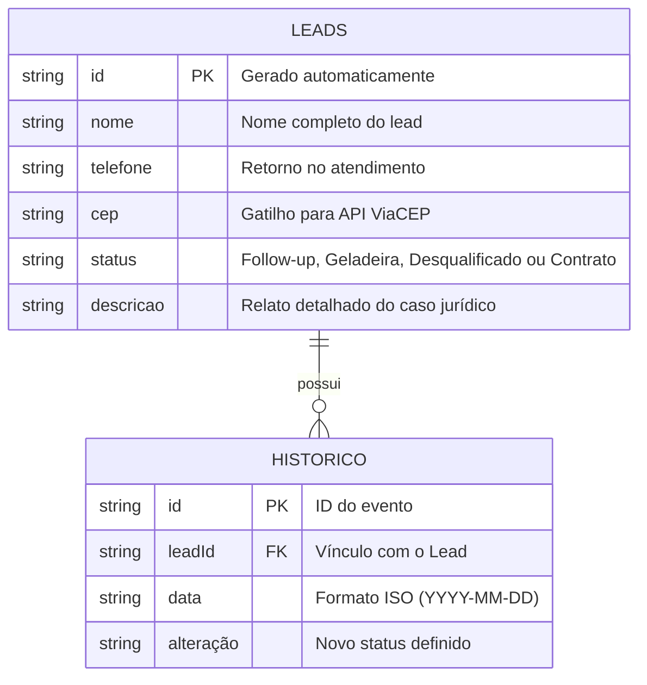

# 🛠️ Especificação Técnica (Tech Spec) - LexFlow
Este documento detalha a arquitetura técnica, o modelo de dados e as integrações de API necessárias para o funcionamento do sistema de triagem jurídica LexFlow.

## 1. Modelo de Dados (Diagrama ER)

Abaixo está a representação da estrutura do nosso banco de dados simulado (db.json) e como as entidades se conectam para permitir o histórico de atendimento.

## 2. Dicionário de Dados

Breve explicação das tabelas principais:

- **Tabelas: leads** Esta é a tabela principal que armazena o dossiê de cada potencial cliente captado pela secretaria.
  - Id: Identificador único gerado pelo JSON Server (String ou Hash).
  - Nome: Nome do lead (obrigatório)
  - Telefone: Número de contato para retorno no atendimento.
  - Cep: Dados de localização. O campo endereco é composto pelos dados retornados pela API externa.
  - Status: Define a fase no funil jurídico. Valores aceitos: Follow-up, Geladeira, Desqualificado, Contrato
  - CPF: Campo opcional na entrada, obrigatório para fechamento de contrato.
  - Descrição: Campo de texto longo para o resumo do caso.

- **Tabela: Historico** 
Registra a linha do tempo de interações com o lead.
  - Id: Identificador único do evento de alteração.
  - LeadId: Chave estrangeira que conecta o histórico ao cliente específico.
  - Alteração:Texto descrevendo o que mudou (Ex: "Cliente movido para Geladeira por falta de documentos")

## 3. Stack Tecnológico
Para garantir a compatibilidade de componentes e a correta interpretação por ferramentas de IA (Cursor/Copilot), este projeto utiliza as seguintes tecnologias e versões:

- **Framework Front-end:** Bootstrap v5.3.3
- **Biblioteca JavaScript:** jQuery v3.7.1
- **API de Endereço:** ViaCEP API v1
- **Servidor de Dados Local:** JSON Server v0.17.
